# Match3Game 架构图集

本文档包含项目的各种架构图和流程图，使用 Mermaid 语法绘制。

## 目录
1. [系统架构图](#系统架构图)
2. [类关系图](#类关系图)
3. [游戏流程图](#游戏流程图)
4. [状态机图](#状态机图)
5. [序列图](#序列图)
6. [数据流图](#数据流图)

---

## 系统架构图

### 整体分层架构

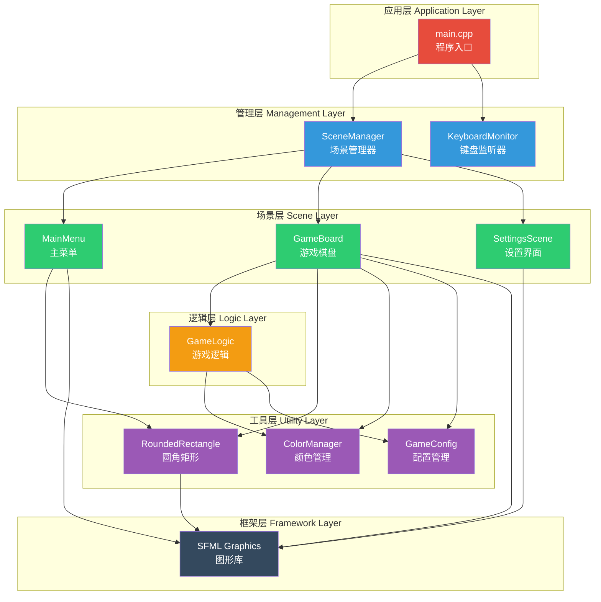
```mermaid
graph TB
    subgraph "应用层 Application Layer"
        A[main.cpp<br/>程序入口]
    end
    
    subgraph "管理层 Management Layer"
        B[SceneManager<br/>场景管理器]
        C[KeyboardMonitor<br/>键盘监听器]
    end
    
    subgraph "场景层 Scene Layer"
        D[MainMenu<br/>主菜单]
        E[GameBoard<br/>游戏棋盘]
        F[SettingsScene<br/>设置界面]
    end
    
    subgraph "逻辑层 Logic Layer"
        G[GameLogic<br/>游戏逻辑]
    end
    
    subgraph "工具层 Utility Layer"
        H[ColorManager<br/>颜色管理]
        I[GameConfig<br/>配置管理]
        J[RoundedRectangle<br/>圆角矩形]
    end
    
    subgraph "框架层 Framework Layer"
        K[SFML Graphics<br/>图形库]
    end
    
    A --> B
    A --> C
    B --> D
    B --> E
    B --> F
    E --> G
    E --> J
    D --> J
    G --> H
    G --> I
    E --> H
    E --> I
    D --> K
    E --> K
    F --> K
    J --> K
    
    style A fill:#e74c3c,color:#fff
    style B fill:#3498db,color:#fff
    style C fill:#3498db,color:#fff
    style D fill:#2ecc71,color:#fff
    style E fill:#2ecc71,color:#fff
    style F fill:#2ecc71,color:#fff
    style G fill:#f39c12,color:#fff
    style H fill:#9b59b6,color:#fff
    style I fill:#9b59b6,color:#fff
    style J fill:#9b59b6,color:#fff
    style K fill:#34495e,color:#fff
```

### 模块依赖关系

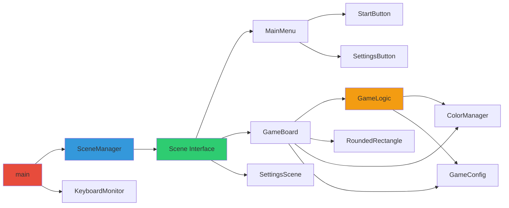
```mermaid
graph LR
    A[main] --> B[SceneManager]
    A --> C[KeyboardMonitor]
    B --> D[Scene Interface]
    D --> E[MainMenu]
    D --> F[GameBoard]
    D --> G[SettingsScene]
    F --> H[GameLogic]
    F --> I[RoundedRectangle]
    E --> J[StartButton]
    E --> K[SettingsButton]
    H --> L[ColorManager]
    H --> M[GameConfig]
    F --> L
    F --> M
    
    style A fill:#e74c3c
    style B fill:#3498db
    style D fill:#2ecc71
    style H fill:#f39c12
```

---

## 类关系图

### 核心类继承关系

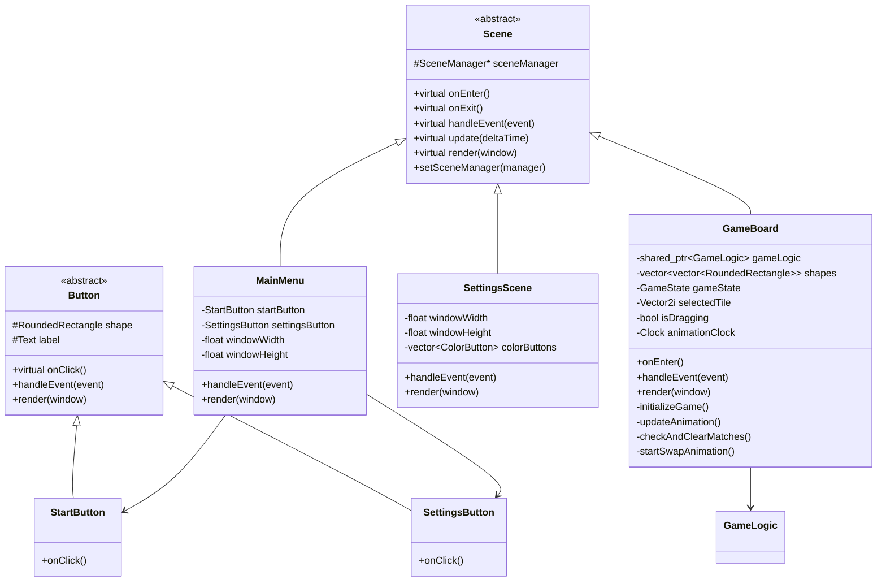
```mermaid
classDiagram
    class Scene {
        <<abstract>>
        #SceneManager* sceneManager
        +virtual onEnter()
        +virtual onExit()
        +virtual handleEvent(event)
        +virtual update(deltaTime)
        +virtual render(window)
        +setSceneManager(manager)
    }
    
    class MainMenu {
        -StartButton startButton
        -SettingsButton settingsButton
        -float windowWidth
        -float windowHeight
        +handleEvent(event)
        +render(window)
    }
    
    class GameBoard {
        -shared_ptr~GameLogic~ gameLogic
        -vector~vector~RoundedRectangle~~ shapes
        -GameState gameState
        -Vector2i selectedTile
        -bool isDragging
        -Clock animationClock
        +onEnter()
        +handleEvent(event)
        +render(window)
        -initializeGame()
        -updateAnimation()
        -checkAndClearMatches()
        -startSwapAnimation()
    }
    
    class SettingsScene {
        -float windowWidth
        -float windowHeight
        -vector~ColorButton~ colorButtons
        +handleEvent(event)
        +render(window)
    }
    
    Scene <|-- MainMenu
    Scene <|-- GameBoard
    Scene <|-- SettingsScene
    
    class Button {
        <<abstract>>
        #RoundedRectangle shape
        #Text label
        +virtual onClick()
        +handleEvent(event)
        +render(window)
    }
    
    class StartButton {
        +onClick()
    }
    
    class SettingsButton {
        +onClick()
    }
    
    Button <|-- StartButton
    Button <|-- SettingsButton
    
    MainMenu --> StartButton
    MainMenu --> SettingsButton
    GameBoard --> GameLogic
```

### GameLogic 类详细结构

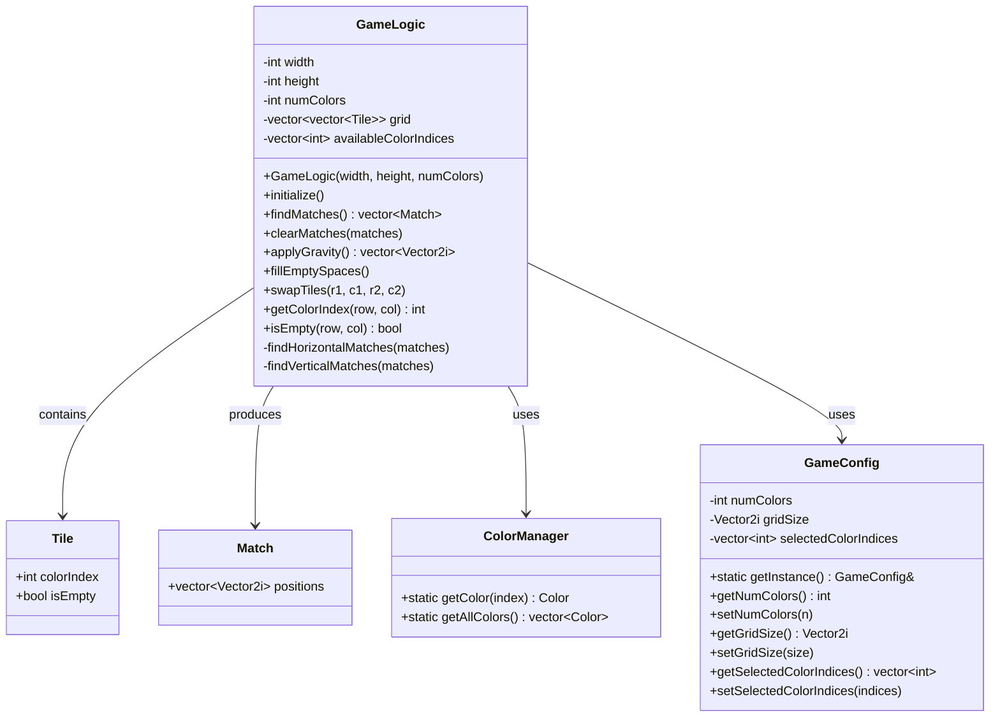
```mermaid
classDiagram
    class GameLogic {
        -int width
        -int height
        -int numColors
        -vector~vector~Tile~~ grid
        -vector~int~ availableColorIndices
        +GameLogic(width, height, numColors)
        +initialize()
        +findMatches() vector~Match~
        +clearMatches(matches)
        +applyGravity() vector~Vector2i~
        +fillEmptySpaces()
        +swapTiles(r1, c1, r2, c2)
        +getColorIndex(row, col) int
        +isEmpty(row, col) bool
        -findHorizontalMatches(matches)
        -findVerticalMatches(matches)
    }
    
    class Tile {
        +int colorIndex
        +bool isEmpty
    }
    
    class Match {
        +vector~Vector2i~ positions
    }
    
    class ColorManager {
        +static getColor(index) Color
        +static getAllColors() vector~Color~
    }
    
    class GameConfig {
        -int numColors
        -Vector2i gridSize
        -vector~int~ selectedColorIndices
        +static getInstance() GameConfig&
        +getNumColors() int
        +setNumColors(n)
        +getGridSize() Vector2i
        +setGridSize(size)
        +getSelectedColorIndices() vector~int~
        +setSelectedColorIndices(indices)
    }
    
    GameLogic --> Tile : contains
    GameLogic --> Match : produces
    GameLogic --> ColorManager : uses
    GameLogic --> GameConfig : uses
```

### SceneManager 类详细结构

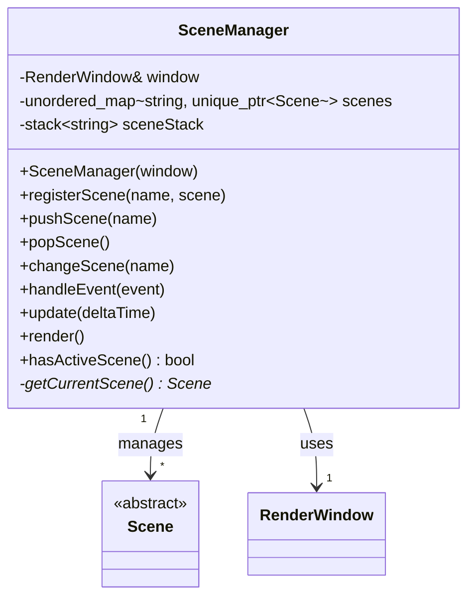
```mermaid
classDiagram
    class SceneManager {
        -RenderWindow& window
        -unordered_map~string, unique_ptr~Scene~~ scenes
        -stack~string~ sceneStack
        +SceneManager(window)
        +registerScene(name, scene)
        +pushScene(name)
        +popScene()
        +changeScene(name)
        +handleEvent(event)
        +update(deltaTime)
        +render()
        +hasActiveScene() bool
        -getCurrentScene() Scene*
    }
    
    class Scene {
        <<abstract>>
    }
    
    SceneManager "1" --> "*" Scene : manages
    SceneManager --> "1" RenderWindow : uses
```

---

## 游戏流程图

### 主游戏循环

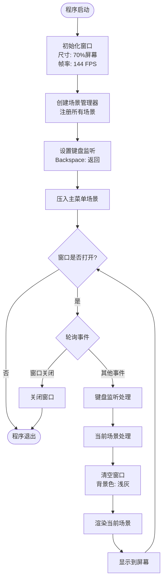
```mermaid
flowchart TD
    Start([程序启动]) --> Init[初始化窗口<br/>尺寸: 70%屏幕<br/>帧率: 144 FPS]
    Init --> InitScenes[创建场景管理器<br/>注册所有场景]
    InitScenes --> InitKeyboard[设置键盘监听<br/>Backspace: 返回]
    InitKeyboard --> PushMenu[压入主菜单场景]
    PushMenu --> GameLoop{窗口是否打开?}
    
    GameLoop -->|是| PollEvent{轮询事件}
    GameLoop -->|否| Exit([程序退出])
    
    PollEvent -->|窗口关闭| CloseWindow[关闭窗口]
    CloseWindow --> Exit
    
    PollEvent -->|其他事件| HandleKeyboard[键盘监听处理]
    HandleKeyboard --> HandleScene[当前场景处理]
    HandleScene --> Clear[清空窗口<br/>背景色: 浅灰]
    Clear --> Render[渲染当前场景]
    Render --> Display[显示到屏幕]
    Display --> GameLoop
```

### 场景切换流程

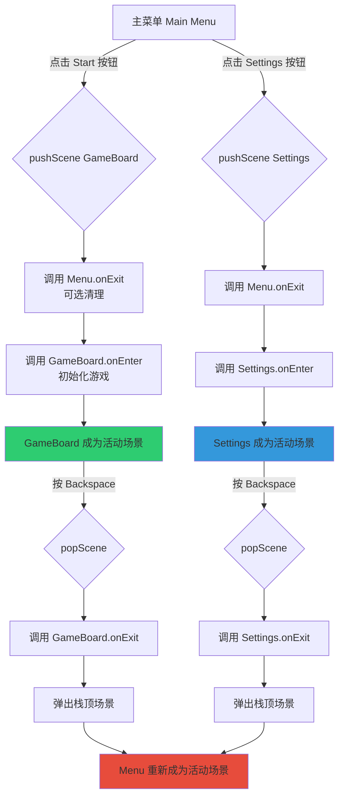
```mermaid
flowchart TD
    A[主菜单 Main Menu] -->|点击 Start 按钮| B{pushScene GameBoard}
    A -->|点击 Settings 按钮| C{pushScene Settings}
    
    B --> D[调用 Menu.onExit<br/>可选清理]
    D --> E[调用 GameBoard.onEnter<br/>初始化游戏]
    E --> F[GameBoard 成为活动场景]
    
    C --> G[调用 Menu.onExit]
    G --> H[调用 Settings.onEnter]
    H --> I[Settings 成为活动场景]
    
    F -->|按 Backspace| J{popScene}
    I -->|按 Backspace| K{popScene}
    
    J --> L[调用 GameBoard.onExit]
    L --> M[弹出栈顶场景]
    M --> N[Menu 重新成为活动场景]
    
    K --> O[调用 Settings.onExit]
    O --> P[弹出栈顶场景]
    P --> N
    
    style F fill:#2ecc71
    style I fill:#3498db
    style N fill:#e74c3c
```

### 完整游戏回合流程

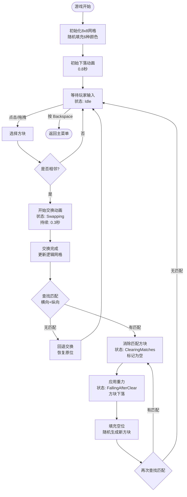
```mermaid
flowchart TD
    Start([游戏开始]) --> Init[初始化8x8网格<br/>随机填充6种颜色]
    Init --> InitFall[初始下落动画<br/>0.8秒]
    InitFall --> WaitInput[等待玩家输入<br/>状态: Idle]
    
    WaitInput -->|点击/拖拽| Select[选择方块]
    Select --> CheckAdjacent{是否相邻?}
    
    CheckAdjacent -->|否| WaitInput
    CheckAdjacent -->|是| StartSwap[开始交换动画<br/>状态: Swapping<br/>持续: 0.3秒]
    
    StartSwap --> SwapComplete[交换完成<br/>更新逻辑网格]
    SwapComplete --> FindMatch{查找匹配<br/>横向+纵向}
    
    FindMatch -->|无匹配| Revert[回退交换<br/>恢复原位]
    Revert --> WaitInput
    
    FindMatch -->|有匹配| Clear[消除匹配方块<br/>状态: ClearingMatches<br/>标记为空]
    Clear --> Gravity[应用重力<br/>状态: FallingAfterClear<br/>方块下落]
    Gravity --> Fill[填充空位<br/>随机生成新方块]
    Fill --> FindAgain{再次查找匹配}
    
    FindAgain -->|有匹配| Clear
    FindAgain -->|无匹配| WaitInput
    
    WaitInput -->|按 Backspace| Exit([返回主菜单])
```

---

## 状态机图

### GameBoard 状态机

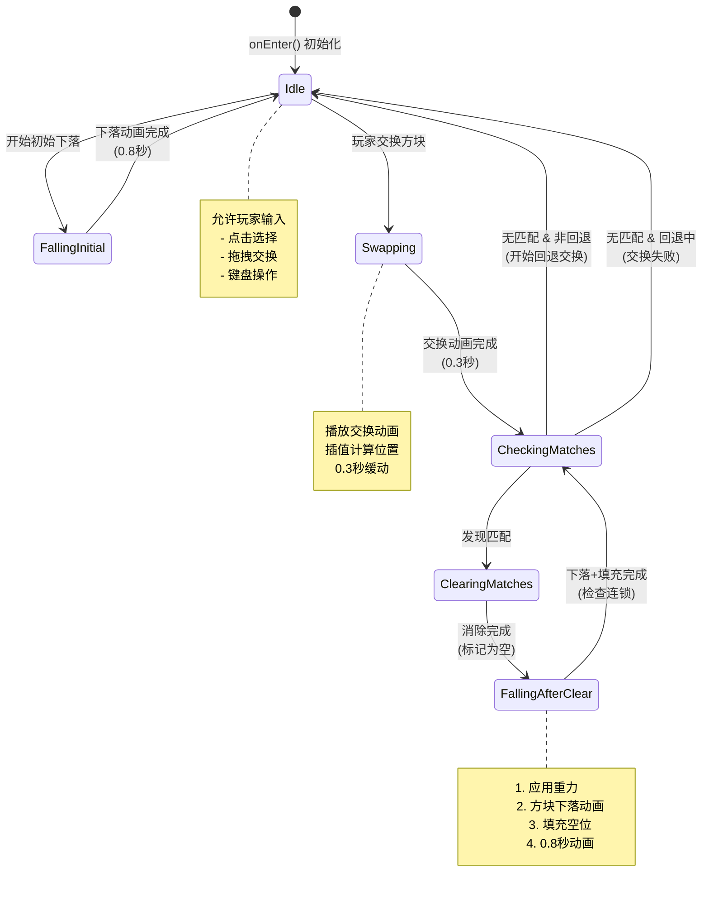
```mermaid
stateDiagram-v2
    [*] --> Idle: onEnter() 初始化
    
    Idle --> FallingInitial: 开始初始下落
    FallingInitial --> Idle: 下落动画完成<br/>(0.8秒)
    
    Idle --> Swapping: 玩家交换方块
    Swapping --> CheckingMatches: 交换动画完成<br/>(0.3秒)
    
    CheckingMatches --> Idle: 无匹配 & 非回退<br/>(开始回退交换)
    CheckingMatches --> Idle: 无匹配 & 回退中<br/>(交换失败)
    CheckingMatches --> ClearingMatches: 发现匹配
    
    ClearingMatches --> FallingAfterClear: 消除完成<br/>(标记为空)
    FallingAfterClear --> CheckingMatches: 下落+填充完成<br/>(检查连锁)
    
    note right of Idle
        允许玩家输入
        - 点击选择
        - 拖拽交换
        - 键盘操作
    end note
    
    note right of Swapping
        播放交换动画
        插值计算位置
        0.3秒缓动
    end note
    
    note right of FallingAfterClear
        1. 应用重力
        2. 方块下落动画
        3. 填充空位
        4. 0.8秒动画
    end note
```

### 交换操作状态流

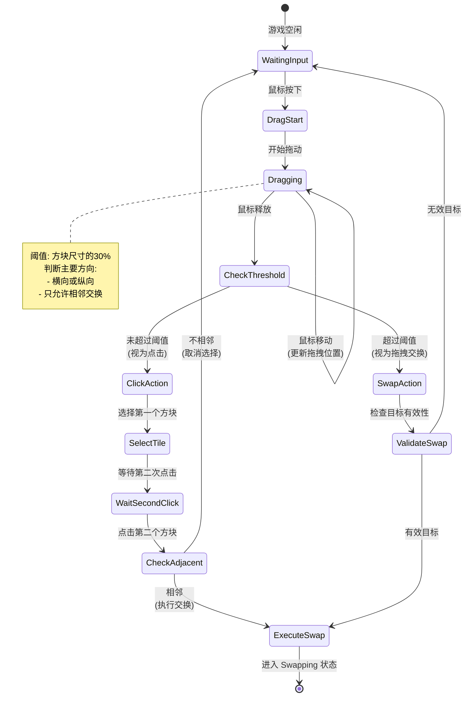
```mermaid
stateDiagram-v2
    [*] --> WaitingInput: 游戏空闲
    
    WaitingInput --> DragStart: 鼠标按下
    DragStart --> Dragging: 开始拖动
    
    Dragging --> Dragging: 鼠标移动<br/>(更新拖拽位置)
    Dragging --> CheckThreshold: 鼠标释放
    
    CheckThreshold --> ClickAction: 未超过阈值<br/>(视为点击)
    CheckThreshold --> SwapAction: 超过阈值<br/>(视为拖拽交换)
    
    ClickAction --> SelectTile: 选择第一个方块
    SelectTile --> WaitSecondClick: 等待第二次点击
    WaitSecondClick --> CheckAdjacent: 点击第二个方块
    
    CheckAdjacent --> WaitingInput: 不相邻<br/>(取消选择)
    CheckAdjacent --> ExecuteSwap: 相邻<br/>(执行交换)
    
    SwapAction --> ValidateSwap: 检查目标有效性
    ValidateSwap --> WaitingInput: 无效目标
    ValidateSwap --> ExecuteSwap: 有效目标
    
    ExecuteSwap --> [*]: 进入 Swapping 状态
    
    note right of Dragging
        阈值: 方块尺寸的30%
        判断主要方向:
        - 横向或纵向
        - 只允许相邻交换
    end note
```

---

## 序列图

### 玩家交换方块序列

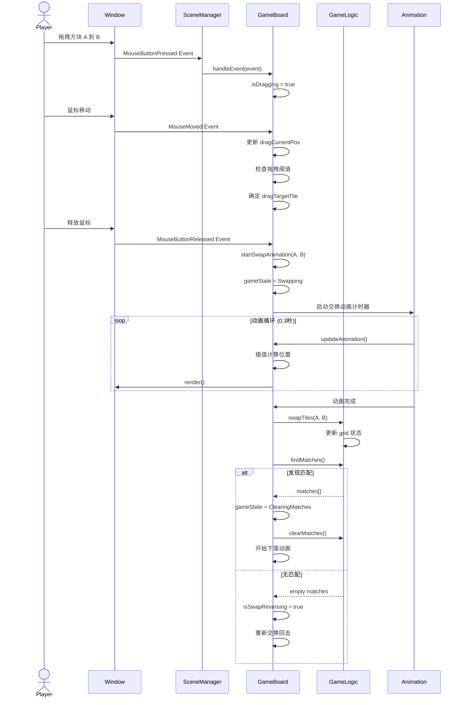
```mermaid
sequenceDiagram
    actor Player
    participant Window
    participant SceneManager
    participant GameBoard
    participant GameLogic
    participant Animation
    
    Player->>Window: 拖拽方块 A 到 B
    Window->>SceneManager: MouseButtonPressed Event
    SceneManager->>GameBoard: handleEvent(event)
    GameBoard->>GameBoard: isDragging = true
    
    Player->>Window: 鼠标移动
    Window->>GameBoard: MouseMoved Event
    GameBoard->>GameBoard: 更新 dragCurrentPos
    GameBoard->>GameBoard: 检查拖拽阈值
    GameBoard->>GameBoard: 确定 dragTargetTile
    
    Player->>Window: 释放鼠标
    Window->>GameBoard: MouseButtonReleased Event
    GameBoard->>GameBoard: startSwapAnimation(A, B)
    GameBoard->>GameBoard: gameState = Swapping
    GameBoard->>Animation: 启动交换动画计时器
    
    loop 动画循环 (0.3秒)
        Animation->>GameBoard: updateAnimation()
        GameBoard->>GameBoard: 插值计算位置
        GameBoard->>Window: render()
    end
    
    Animation->>GameBoard: 动画完成
    GameBoard->>GameLogic: swapTiles(A, B)
    GameLogic->>GameLogic: 更新 grid 状态
    GameBoard->>GameLogic: findMatches()
    
    alt 发现匹配
        GameLogic-->>GameBoard: matches[]
        GameBoard->>GameBoard: gameState = ClearingMatches
        GameBoard->>GameLogic: clearMatches()
        GameBoard->>GameBoard: 开始下落动画
    else 无匹配
        GameLogic-->>GameBoard: empty matches
        GameBoard->>GameBoard: isSwapReversing = true
        GameBoard->>GameBoard: 重新交换回去
    end
```

### 消除连锁序列

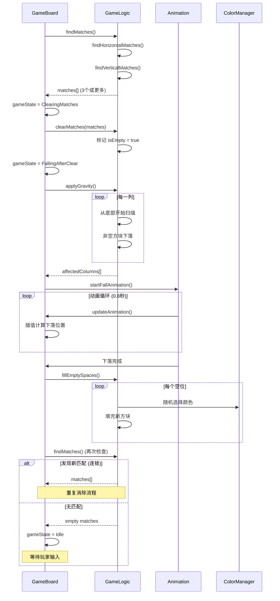
```mermaid
sequenceDiagram
    participant GameBoard
    participant GameLogic
    participant Animation
    participant ColorManager
    
    GameBoard->>GameLogic: findMatches()
    GameLogic->>GameLogic: findHorizontalMatches()
    GameLogic->>GameLogic: findVerticalMatches()
    GameLogic-->>GameBoard: matches[] (3个或更多)
    
    GameBoard->>GameBoard: gameState = ClearingMatches
    GameBoard->>GameLogic: clearMatches(matches)
    GameLogic->>GameLogic: 标记 isEmpty = true
    
    GameBoard->>GameBoard: gameState = FallingAfterClear
    GameBoard->>GameLogic: applyGravity()
    
    loop 每一列
        GameLogic->>GameLogic: 从底部开始扫描
        GameLogic->>GameLogic: 非空方块下落
    end
    
    GameLogic-->>GameBoard: affectedColumns[]
    GameBoard->>Animation: startFallAnimation()
    
    loop 动画循环 (0.8秒)
        Animation->>GameBoard: updateAnimation()
        GameBoard->>GameBoard: 插值计算下落位置
    end
    
    Animation->>GameBoard: 下落完成
    GameBoard->>GameLogic: fillEmptySpaces()
    
    loop 每个空位
        GameLogic->>ColorManager: 随机选择颜色
        GameLogic->>GameLogic: 填充新方块
    end
    
    GameBoard->>GameLogic: findMatches() (再次检查)
    
    alt 发现新匹配 (连锁)
        GameLogic-->>GameBoard: matches[]
        Note over GameBoard,GameLogic: 重复消除流程
    else 无匹配
        GameLogic-->>GameBoard: empty matches
        GameBoard->>GameBoard: gameState = Idle
        Note over GameBoard: 等待玩家输入
    end
```

### 场景管理序列

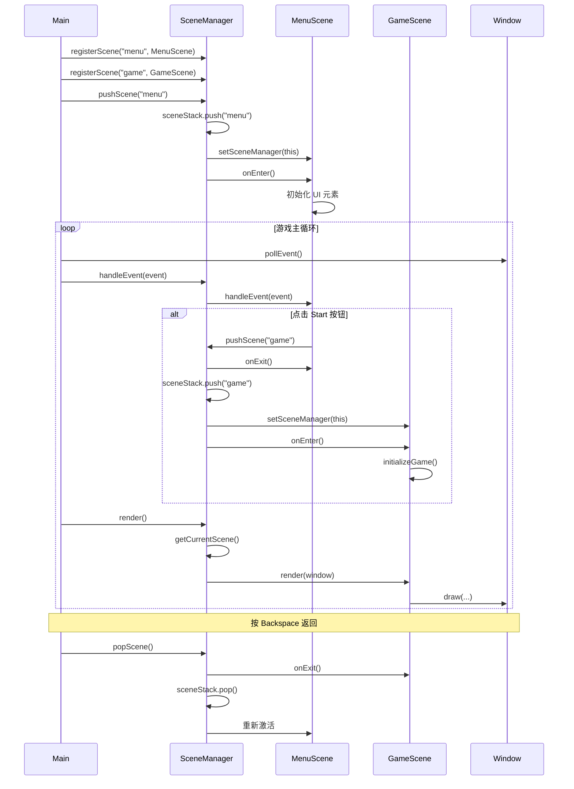
```mermaid
sequenceDiagram
    participant Main
    participant SceneManager
    participant MenuScene
    participant GameScene
    participant Window
    
    Main->>SceneManager: registerScene("menu", MenuScene)
    Main->>SceneManager: registerScene("game", GameScene)
    Main->>SceneManager: pushScene("menu")
    
    SceneManager->>SceneManager: sceneStack.push("menu")
    SceneManager->>MenuScene: setSceneManager(this)
    SceneManager->>MenuScene: onEnter()
    MenuScene->>MenuScene: 初始化 UI 元素
    
    loop 游戏主循环
        Main->>Window: pollEvent()
        Main->>SceneManager: handleEvent(event)
        SceneManager->>MenuScene: handleEvent(event)
        
        alt 点击 Start 按钮
            MenuScene->>SceneManager: pushScene("game")
            SceneManager->>MenuScene: onExit()
            SceneManager->>SceneManager: sceneStack.push("game")
            SceneManager->>GameScene: setSceneManager(this)
            SceneManager->>GameScene: onEnter()
            GameScene->>GameScene: initializeGame()
        end
        
        Main->>SceneManager: render()
        SceneManager->>SceneManager: getCurrentScene()
        SceneManager->>GameScene: render(window)
        GameScene->>Window: draw(...)
    end
    
    Note over Main,Window: 按 Backspace 返回
    
    Main->>SceneManager: popScene()
    SceneManager->>GameScene: onExit()
    SceneManager->>SceneManager: sceneStack.pop()
    SceneManager->>MenuScene: 重新激活
```

---

## 数据流图

### 游戏状态数据流

```mermaid
flowchart LR
    A[GameConfig<br/>配置数据] -->|初始化参数| B[GameLogic<br/>逻辑层]
    B -->|网格状态| C[GameBoard<br/>显示层]
    C -->|颜色索引| D[ColorManager<br/>颜色数据]
    D -->|RGB 值| C
    
    E[玩家输入] -->|事件| C
    C -->|操作命令| B
    B -->|状态变化| C
    C -->|渲染指令| F[SFML Window<br/>渲染目标]
    
    B -->|匹配结果| C
    B -->|重力计算| C
    C -->|动画参数| G[Animation System<br/>动画系统]
    G -->|插值位置| C
    
    style A fill:#9b59b6
    style B fill:#f39c12
    style C fill:#2ecc71
    style D fill:#9b59b6
    style E fill:#e74c3c
    style F fill:#34495e
    style G fill:#3498db
```

### 匹配检测数据流

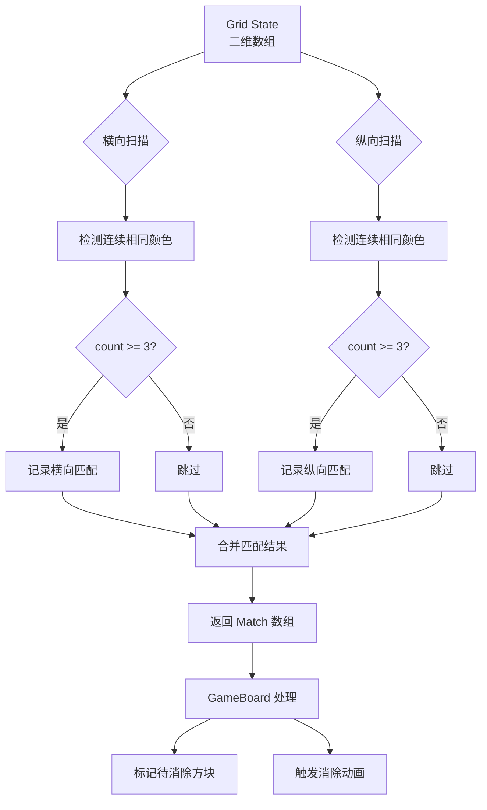
```mermaid
flowchart TD
    A[Grid State<br/>二维数组] --> B{横向扫描}
    A --> C{纵向扫描}
    
    B --> D[检测连续相同颜色]
    C --> E[检测连续相同颜色]
    
    D --> F{count >= 3?}
    E --> G{count >= 3?}
    
    F -->|是| H[记录横向匹配]
    F -->|否| I[跳过]
    G -->|是| J[记录纵向匹配]
    G -->|否| K[跳过]
    
    H --> L[合并匹配结果]
    J --> L
    I --> L
    K --> L
    
    L --> M[返回 Match 数组]
    M --> N[GameBoard 处理]
    
    N --> O[标记待消除方块]
    N --> P[触发消除动画]
```

### 动画系统数据流

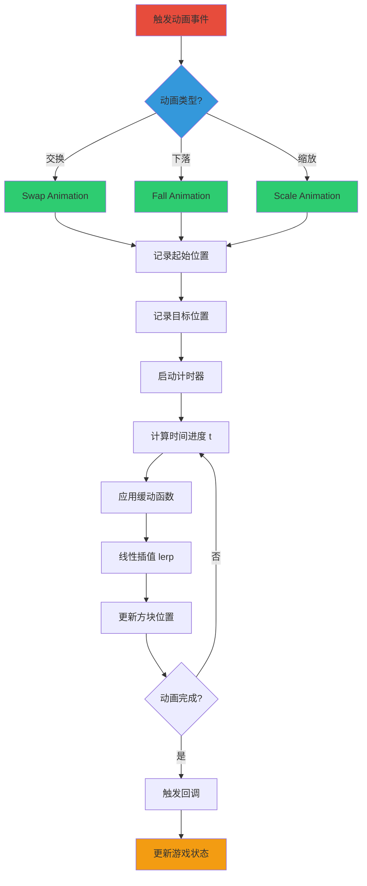
```mermaid
flowchart TD
    A[触发动画事件] --> B{动画类型?}
    
    B -->|交换| C[Swap Animation]
    B -->|下落| D[Fall Animation]
    B -->|缩放| E[Scale Animation]
    
    C --> F[记录起始位置]
    D --> F
    E --> F
    
    F --> G[记录目标位置]
    G --> H[启动计时器]
    H --> I[计算时间进度 t]
    
    I --> J[应用缓动函数]
    J --> K[线性插值 lerp]
    
    K --> L[更新方块位置]
    L --> M{动画完成?}
    
    M -->|否| I
    M -->|是| N[触发回调]
    N --> O[更新游戏状态]
    
    style A fill:#e74c3c
    style B fill:#3498db
    style C fill:#2ecc71
    style D fill:#2ecc71
    style E fill:#2ecc71
    style O fill:#f39c12
```

### 事件处理数据流

```mermaid
flowchart TD
    A[SFML Event] --> B[Window.pollEvent]
    B --> C{事件类型?}
    
    C -->|Closed| D[window.close]
    C -->|Keyboard| E[KeyboardMonitor]
    C -->|Mouse| F[SceneManager]
    
    E --> G{全局快捷键?}
    G -->|Backspace| H[sceneManager.popScene]
    G -->|其他| I[忽略]
    
    F --> J[getCurrentScene]
    J --> K[scene.handleEvent]
    
    K --> L{场景类型?}
    L -->|MainMenu| M[处理按钮点击]
    L -->|GameBoard| N[处理游戏交互]
    L -->|Settings| O[处理设置更改]
    
    N --> P{交互类型?}
    P -->|点击| Q[handleTileClick]
    P -->|拖拽| R[handleDrag]
    
    Q --> S[更新选择状态]
    R --> T[更新拖拽状态]
    
    S --> U[gameLogic.swapTiles]
    T --> U
    
    U --> V[checkAndClearMatches]
    
    style A fill:#34495e
    style E fill:#3498db
    style F fill:#3498db
    style N fill:#2ecc71
    style U fill:#f39c12
    style V fill:#f39c12
```

---

## 组件交互图

### GameBoard 内部组件交互

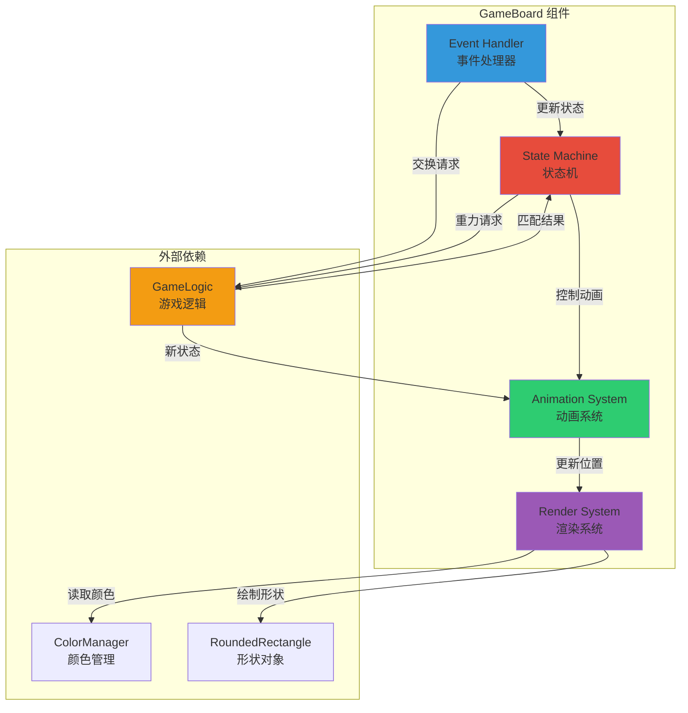
```mermaid
graph TB
    subgraph "GameBoard 组件"
        A[Event Handler<br/>事件处理器]
        B[Animation System<br/>动画系统]
        C[Render System<br/>渲染系统]
        D[State Machine<br/>状态机]
    end
    
    subgraph "外部依赖"
        E[GameLogic<br/>游戏逻辑]
        F[ColorManager<br/>颜色管理]
        G[RoundedRectangle<br/>形状对象]
    end
    
    A -->|更新状态| D
    D -->|控制动画| B
    B -->|更新位置| C
    C -->|读取颜色| F
    C -->|绘制形状| G
    
    A -->|交换请求| E
    E -->|匹配结果| D
    D -->|重力请求| E
    E -->|新状态| B
    
    style A fill:#3498db
    style B fill:#2ecc71
    style C fill:#9b59b6
    style D fill:#e74c3c
    style E fill:#f39c12
```

### 多场景协作图

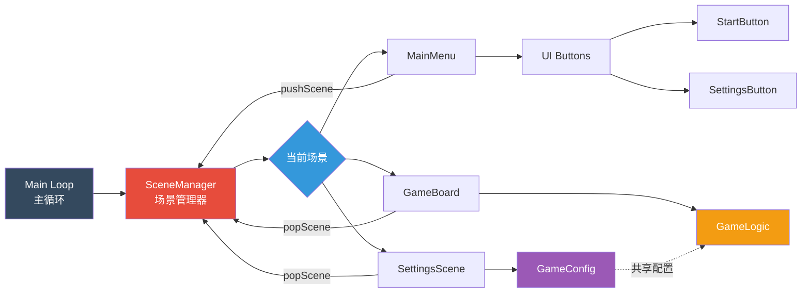
```mermaid
graph LR
    A[Main Loop<br/>主循环] --> B[SceneManager<br/>场景管理器]
    
    B --> C{当前场景}
    
    C --> D[MainMenu]
    C --> E[GameBoard]
    C --> F[SettingsScene]
    
    D -->|pushScene| B
    E -->|popScene| B
    F -->|popScene| B
    
    E --> G[GameLogic]
    F --> H[GameConfig]
    
    H -.共享配置.-> G
    
    D --> I[UI Buttons]
    I --> J[StartButton]
    I --> K[SettingsButton]
    
    style A fill:#34495e,color:#fff
    style B fill:#e74c3c,color:#fff
    style C fill:#3498db,color:#fff
    style G fill:#f39c12,color:#fff
    style H fill:#9b59b6,color:#fff
```

---

## 总结

本文档提供了 Match3Game 项目的完整架构可视化，包括：

1. **系统架构** - 分层设计和模块依赖
2. **类关系** - 继承、组合和依赖关系
3. **游戏流程** - 主循环、场景切换、游戏回合
4. **状态机** - GameBoard 和交换操作的状态转换
5. **序列图** - 关键操作的时序交互
6. **数据流** - 数据在各组件间的流动

这些图表帮助开发者快速理解项目结构，便于维护和扩展。
