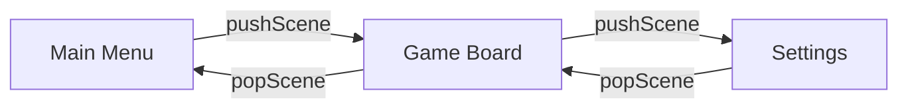
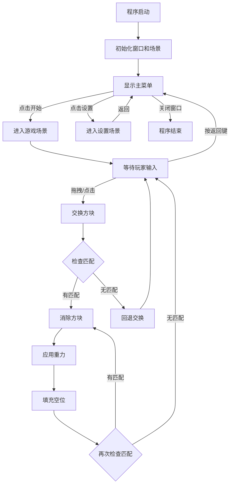
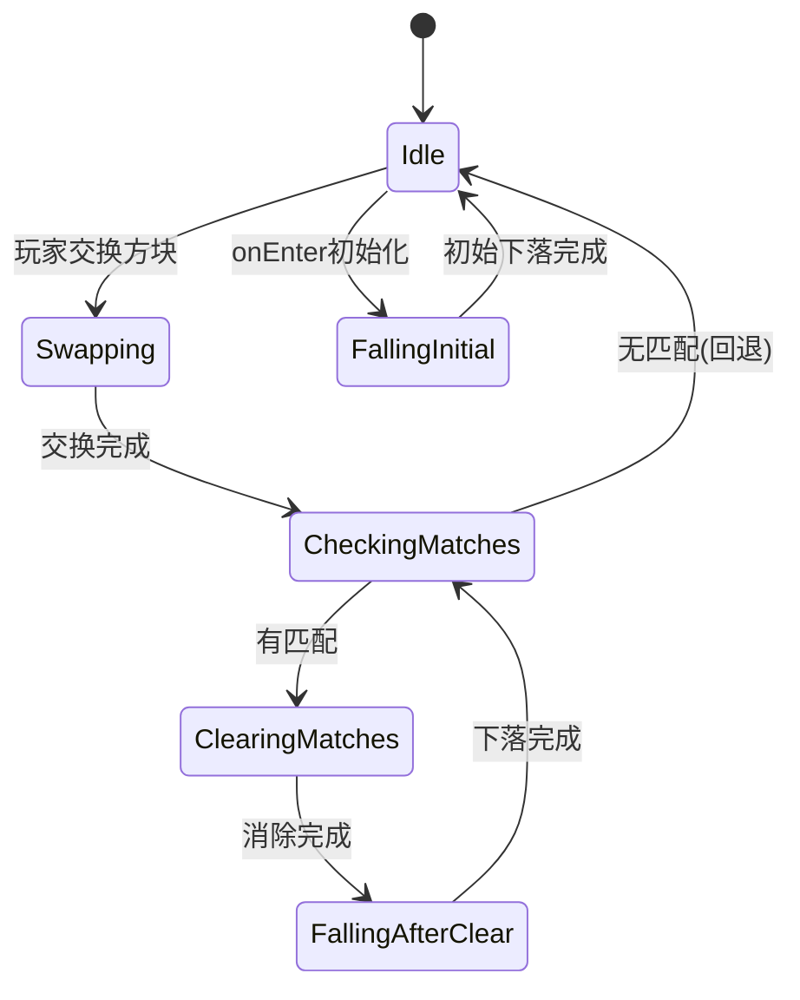

# Match3Game 完整项目文档

## 目录
1. [项目概述](#项目概述)
2. [技术栈](#技术栈)
3. [系统架构](#系统架构)
4. [核心模块](#核心模块)
5. [游戏流程](#游戏流程)
6. [类图与架构图](#类图与架构图)
7. [关键算法](#关键算法)
8. [构建与运行](#构建与运行)

---

## 项目概述

**Match3Game** 是一个基于 SFML 图形库开发的三消类益智游戏，采用现代 C++17 标准实现。游戏实现了经典的消除玩法，玩家通过交换相邻的彩色方块，使得三个或更多相同颜色的方块连成一线即可消除。

### 核心特性
- ✅ 流畅的动画效果（交换、下落、消除）
- ✅ 拖拽交互支持（鼠标拖动方块）
- ✅ 自动消除和重力系统
- ✅ 场景管理系统（菜单、游戏、设置）
- ✅ 可配置的游戏参数（网格大小、颜色数量）
- ✅ 圆角矩形渲染
- ✅ 键盘快捷键支持

---

## 技术栈

### 开发环境
- **语言**: C++17
- **构建工具**: CMake 3.28+
- **编译器**: MinGW (GCC/G++)
- **IDE**: Visual Studio Code

### 依赖库
- **SFML 3.0.2** - 图形、窗口、事件处理
  - SFML::Graphics - 图形渲染
  - 通过 CMake FetchContent 自动下载

### 项目结构
```
Match3Game/
├── CMakeLists.txt          # CMake 构建脚本
├── include/                # 头文件目录
│   ├── core/              # 核心系统
│   │   ├── Scene.h
│   │   ├── SceneManager.h
│   │   └── GameLogic.h
│   ├── ui/                # UI 组件
│   │   ├── MainMenu.h
│   │   ├── GameBoard.h
│   │   ├── SettingsScene.h
│   │   ├── Button.h
│   │   ├── StartButton.h
│   │   └── SettingsButton.h
│   └── utils/             # 工具类
│       ├── ColorManager.h
│       ├── GameConfig.h
│       ├── KeyboardMonitor.h
│       └── RoundedRectangle.h
├── src/                   # 源文件目录
│   ├── main.cpp
│   ├── core/
│   ├── ui/
│   └── utils/
└── build/                 # 构建输出目录
```

---

## 系统架构

### 整体架构设计

```
┌─────────────────────────────────────────────────────────────┐
│                        Application Layer                     │
│                          (main.cpp)                          │
└───────────────────────┬─────────────────────────────────────┘
                        │
        ┌───────────────┴───────────────┐
        │                               │
        ▼                               ▼
┌──────────────────┐           ┌──────────────────┐
│  SceneManager    │◄──────────│  KeyboardMonitor │
│  (场景管理器)     │           │  (键盘监听器)     │
└────────┬─────────┘           └──────────────────┘
         │
         │ manages
         │
         ▼
┌─────────────────────────────────────────────┐
│               Scene (抽象基类)               │
│  • onEnter()  • onExit()                   │
│  • handleEvent()  • render()               │
└────────┬────────────────────────────────────┘
         │
         │ implements
         │
    ┌────┴────┬──────────────┬──────────────┐
    │         │              │              │
    ▼         ▼              ▼              ▼
┌─────────┐ ┌──────────┐ ┌─────────────┐ ┌─────────┐
│MainMenu │ │GameBoard │ │SettingsScene│ │  ...    │
│(主菜单)  │ │(游戏场景) │ │(设置场景)   │ │         │
└─────────┘ └────┬─────┘ └─────────────┘ └─────────┘
                 │
                 │ uses
                 │
                 ▼
        ┌────────────────┐
        │   GameLogic    │
        │   (游戏逻辑)    │
        │                │
        │ • Grid State   │
        │ • Match Find   │
        │ • Gravity      │
        │ • Swap Tiles   │
        └────────────────┘
                 │
                 │ uses
                 │
    ┌────────────┴────────────┐
    │                         │
    ▼                         ▼
┌──────────────┐      ┌──────────────┐
│ ColorManager │      │ GameConfig   │
│ (颜色管理器)  │      │ (游戏配置)    │
└──────────────┘      └──────────────┘
```

### 架构说明

#### 1. **分层架构**
- **应用层**: `main.cpp` - 程序入口，初始化窗口和主循环
- **管理层**: `SceneManager` - 场景生命周期管理、场景栈
- **场景层**: 各种 `Scene` 实现 - 游戏不同界面
- **逻辑层**: `GameLogic` - 游戏核心逻辑
- **工具层**: 辅助类和工具函数

#### 2. **设计模式**

**场景管理模式 (Scene Pattern)**
```cpp
class Scene {
    virtual void onEnter()  // 场景进入时调用
    virtual void onExit()   // 场景退出时调用
    virtual void handleEvent()  // 处理事件
    virtual void render()   // 渲染场景
}
```

**单例模式 (Singleton)**
```cpp
GameConfig::getInstance()  // 全局配置管理
ColorManager::getColor()   // 颜色管理（静态方法）
```

**观察者模式 (Observer)**
```cpp
KeyboardMonitor.setCallback(key, callback)  // 键盘事件回调
```

---

## 核心模块

### 1. SceneManager（场景管理器）

**职责**: 管理所有游戏场景的生命周期和切换

**核心方法**:
```cpp
void registerScene(name, scene)  // 注册场景
void pushScene(name)             // 压入场景栈
void popScene()                  // 弹出当前场景
void changeScene(name)           // 切换场景
```

**场景栈机制**:
```
┌─────────────────────┐
│   Settings Scene    │  ← Top (当前活动场景)
├─────────────────────┤
│    Game Board       │
├─────────────────────┤
│    Main Menu        │  ← Bottom
└─────────────────────┘
```

**工作流程**:


### 2. GameLogic（游戏核心逻辑）

**职责**: 处理所有游戏规则和状态管理

**数据结构**:
```cpp
struct Tile {
    int colorIndex;      // 颜色索引
    bool isEmpty;        // 是否为空
};

struct Match {
    vector<Vector2i> positions;  // 匹配的位置列表
};
```

**核心算法**:

1. **匹配检测** (`findMatches()`)
   - 横向扫描：检测连续3个或以上相同颜色
   - 纵向扫描：检测连续3个或以上相同颜色
   
2. **重力系统** (`applyGravity()`)
   - 逐列从下往上扫描
   - 非空方块下落填补空位
   
3. **填充空白** (`fillEmptySpaces()`)
   - 随机生成新方块填充空位

### 3. GameBoard（游戏棋盘）

**状态机**:
```cpp
enum class GameState {
    Idle,                  // 等待玩家操作
    Swapping,              // 交换动画中
    FallingInitial,        // 初始下落
    CheckingMatches,       // 检查匹配
    ClearingMatches,       // 消除匹配
    FallingAfterClear      // 消除后下落
};
```

**交互模式**:
- **点击模式**: 点击两个相邻方块进行交换
- **拖拽模式**: 拖动方块到相邻位置

**动画系统**:
```cpp
// 动画参数
startPositions[][]      // 起始位置
targetPositions[][]     // 目标位置
animationClock          // 动画时钟

// 插值计算
float t = elapsed / duration;
currentPos = lerp(startPos, targetPos, t);
```

### 4. ColorManager（颜色管理）

**预定义色板**:
```cpp
static colors[] = {
    {231, 76, 60},    // 红色
    {46, 204, 113},   // 绿色
    {52, 152, 219},   // 蓝色
    {241, 196, 15},   // 黄色
    {155, 89, 182},   // 紫色
    {230, 126, 34},   // 橙色
    {26, 188, 156},   // 青色
    {52, 73, 94}      // 灰色
};
```

### 5. GameConfig（游戏配置）

**可配置参数**:
```cpp
int numColors;                    // 颜色数量 (默认: 6)
Vector2i gridSize;                // 网格尺寸 (默认: 8x8)
vector<int> selectedColorIndices; // 选中的颜色索引
```

---

## 游戏流程

### 主流程图



### 游戏循环（Game Loop）

```cpp
while (window.isOpen()) {
    // 1. 事件处理
    while (pollEvent(event)) {
        handleEvent(event);
    }
    
    // 2. 更新逻辑
    updateAnimation();
    
    // 3. 渲染
    window.clear();
    sceneManager.render();
    window.display();
}
```

### 消除循环流程

```
┌─────────────────────────────────────────────────┐
│              消除循环 (Cascade)                  │
└─────────────────────────────────────────────────┘

1. 玩家交换方块
         │
         ▼
2. 检查匹配 ──────► 无匹配 ──► 回退交换 ──► 结束
         │
         │ 有匹配
         ▼
3. 消除方块 (动画)
         │
         ▼
4. 应用重力 (下落动画)
         │
         ▼
5. 填充空位 (随机生成)
         │
         ▼
6. 再次检查匹配 ──► 无匹配 ──► 结束
         │
         │ 有匹配
         │
         └─────────► 回到步骤 3 (连锁消除)
```

### 状态转换图



---

## 类图与架构图

### 核心类图

```
┌─────────────────────────────────────────────────────────┐
│                         Scene                            │
│  (Abstract Base Class)                                   │
├─────────────────────────────────────────────────────────┤
│  # sceneManager: SceneManager*                           │
├─────────────────────────────────────────────────────────┤
│  + virtual onEnter(): void                               │
│  + virtual onExit(): void                                │
│  + virtual handleEvent(event): void = 0                  │
│  + virtual update(deltaTime): void                       │
│  + virtual render(window): void = 0                      │
│  + setSceneManager(manager): void                        │
└───────────────────┬─────────────────────────────────────┘
                    │
        ┌───────────┼───────────┬──────────────┐
        │           │           │              │
        ▼           ▼           ▼              ▼
┌──────────────────────────────────────────────────────┐
│              MainMenu : Scene                         │
├──────────────────────────────────────────────────────┤
│  - startButton: StartButton                           │
│  - settingsButton: SettingsButton                     │
│  - windowWidth: float                                 │
│  - windowHeight: float                                │
├──────────────────────────────────────────────────────┤
│  + handleEvent(event): void override                  │
│  + render(window): void override                      │
└──────────────────────────────────────────────────────┘

┌──────────────────────────────────────────────────────┐
│              GameBoard : Scene                        │
├──────────────────────────────────────────────────────┤
│  - gameLogic: shared_ptr<GameLogic>                   │
│  - shapes: vector<vector<RoundedRectangle>>           │
│  - gameState: GameState                               │
│  - selectedTile: Vector2i                             │
│  - isDragging: bool                                   │
│  - animationClock: Clock                              │
├──────────────────────────────────────────────────────┤
│  + onEnter(): void override                           │
│  + handleEvent(event): void override                  │
│  + render(window): void override                      │
│  - initializeGame(): void                             │
│  - updateAnimation(): void                            │
│  - checkAndClearMatches(): void                       │
│  - startSwapAnimation(): void                         │
│  - startFallAnimation(): void                         │
└──────────────────────────────────────────────────────┘

┌──────────────────────────────────────────────────────┐
│              GameLogic                                │
├──────────────────────────────────────────────────────┤
│  - width: int                                         │
│  - height: int                                        │
│  - numColors: int                                     │
│  - grid: vector<vector<Tile>>                         │
│  - availableColorIndices: vector<int>                 │
├──────────────────────────────────────────────────────┤
│  + initialize(): void                                 │
│  + findMatches(): vector<Match>                       │
│  + clearMatches(matches): void                        │
│  + applyGravity(): vector<Vector2i>                   │
│  + fillEmptySpaces(): void                            │
│  + swapTiles(r1,c1,r2,c2): void                       │
│  + getColorIndex(row, col): int                       │
│  + isEmpty(row, col): bool                            │
│  - findHorizontalMatches(matches): void               │
│  - findVerticalMatches(matches): void                 │
└──────────────────────────────────────────────────────┘

┌──────────────────────────────────────────────────────┐
│              SceneManager                             │
├──────────────────────────────────────────────────────┤
│  - window: RenderWindow&                              │
│  - scenes: unordered_map<string, unique_ptr<Scene>>   │
│  - sceneStack: stack<string>                          │
├──────────────────────────────────────────────────────┤
│  + registerScene(name, scene): void                   │
│  + pushScene(name): void                              │
│  + popScene(): void                                   │
│  + changeScene(name): void                            │
│  + handleEvent(event): void                           │
│  + render(): void                                     │
│  - getCurrentScene(): Scene*                          │
└──────────────────────────────────────────────────────┘
```

### 组件关系图

```
┌─────────────────────────────────────────────────────┐
│                    main.cpp                          │
│  ┌──────────────┐  ┌──────────────┐                 │
│  │RenderWindow  │  │KeyboardMonitor│                 │
│  └──────┬───────┘  └───────┬──────┘                 │
│         │                  │                         │
│         └──────────┬───────┘                         │
│                    │                                 │
│              ┌─────▼──────┐                          │
│              │SceneManager│                          │
│              └─────┬──────┘                          │
└────────────────────┼─────────────────────────────────┘
                     │
        ┌────────────┼────────────┐
        │            │            │
   ┌────▼───┐  ┌────▼────┐  ┌───▼─────┐
   │MainMenu│  │GameBoard│  │Settings │
   └────────┘  └────┬────┘  └─────────┘
                    │
              ┌─────┴─────┐
              │           │
         ┌────▼────┐ ┌───▼────────┐
         │GameLogic│ │RoundRect   │
         └────┬────┘ └────────────┘
              │
    ┌─────────┴─────────┐
    │                   │
┌───▼────────┐  ┌──────▼──────┐
│ColorManager│  │GameConfig   │
└────────────┘  └─────────────┘
```

---

## 关键算法

### 1. 匹配检测算法

**横向匹配检测**:
```cpp
void findHorizontalMatches(vector<Match>& matches) {
    for (int row = 0; row < height; row++) {
        for (int col = 0; col < width; col++) {
            if (isEmpty(row, col)) continue;
            
            int color = getColor(row, col);
            int count = 1;
            
            // 向右扫描相同颜色
            while (col + count < width && 
                   getColor(row, col + count) == color) {
                count++;
            }
            
            // 至少3个才算匹配
            if (count >= 3) {
                Match match;
                for (int k = 0; k < count; k++) {
                    match.positions.push_back({col + k, row});
                }
                matches.push_back(match);
                col += count - 1;  // 跳过已匹配的
            }
        }
    }
}
```

**时间复杂度**: O(width × height)

### 2. 重力算法

```cpp
vector<Vector2i> applyGravity() {
    vector<Vector2i> affected;
    
    for (int col = 0; col < width; col++) {
        int writePos = height - 1;  // 从底部开始写入
        
        // 从下往上扫描
        for (int row = height - 1; row >= 0; row--) {
            if (!isEmpty(row, col)) {
                if (row != writePos) {
                    // 移动方块
                    grid[writePos][col] = grid[row][col];
                    grid[row][col].isEmpty = true;
                }
                writePos--;
            }
        }
    }
    
    return affected;
}
```

**算法特点**:
- 单次遍历，逐列处理
- 时间复杂度: O(width × height)
- 空间复杂度: O(1) (原地修改)

### 3. 动画插值算法

```cpp
void updateAnimation() {
    float t = animationClock.getElapsedTime().asSeconds() / duration;
    t = clamp(t, 0.0f, 1.0f);
    
    // 缓动函数 (easeInOutQuad)
    if (t < 0.5f) {
        t = 2 * t * t;
    } else {
        t = -1 + (4 - 2 * t) * t;
    }
    
    // 线性插值
    for (int row = 0; row < height; row++) {
        for (int col = 0; col < width; col++) {
            Vector2f current = lerp(
                startPositions[row][col],
                targetPositions[row][col],
                t
            );
            shapes[row][col].setPosition(current);
        }
    }
}
```

### 4. 拖拽检测算法

```cpp
void handleDrag(Vector2f currentPos) {
    Vector2f delta = currentPos - startPos;
    float threshold = tileSize * 0.3f;
    
    // 判断主要方向
    if (abs(delta.x) > abs(delta.y)) {
        // 横向拖拽
        if (delta.x > threshold) {
            targetTile = startTile + Vector2i(1, 0);  // 右
        } else if (delta.x < -threshold) {
            targetTile = startTile + Vector2i(-1, 0); // 左
        }
    } else {
        // 纵向拖拽
        if (delta.y > threshold) {
            targetTile = startTile + Vector2i(0, 1);  // 下
        } else if (delta.y < -threshold) {
            targetTile = startTile + Vector2i(0, -1); // 上
        }
    }
}
```

---

## 构建与运行

### 环境要求

- CMake 3.28+
- C++17 兼容编译器
- MinGW (Windows) / GCC (Linux) / Clang (macOS)
- SFML 3.0.2 (自动下载)

### 构建步骤

#### Windows (MinGW)

```powershell
# 配置项目
cmake -S . -B build -G "MinGW Makefiles"

# 编译 Debug 版本
cmake --build build --config Debug -- -j

# 编译 Release 版本
cmake --build build --config Release -- -j

# 运行
.\build\bin\Match3Game.exe
```

#### Linux / macOS

```bash
# 配置项目
cmake -B build

# 编译
cmake --build build -- -j

# 运行
./build/bin/Match3Game
```

### VS Code 任务

项目配置了以下 VS Code 任务：

1. **CMake Configure** - 配置 CMake 项目
2. **Build Debug** - 编译调试版本 (默认)
3. **Build Release** - 编译发布版本

快捷键: `Ctrl+Shift+B` 运行默认构建任务

### 项目配置

编辑 `CMakeLists.txt`:

```cmake
project(Match3Game LANGUAGES CXX)  # 项目名称
set(CMAKE_CXX_STANDARD 17)         # C++ 标准
```

编辑 `src/utils/GameConfig.cpp` 修改默认配置:

```cpp
GameConfig::GameConfig() 
    : numColors(6)              // 颜色数量
    , gridSize(8, 8)            // 网格尺寸
    , selectedColorIndices(...) // 颜色索引
{}
```

---

## 代码规范

### 命名约定

- **类名**: PascalCase (如 `GameBoard`, `SceneManager`)
- **函数名**: camelCase (如 `handleEvent`, `findMatches`)
- **变量名**: camelCase (如 `windowSize`, `tileSize`)
- **常量**: UPPER_SNAKE_CASE (如 `MAX_COLORS`)
- **私有成员**: 无前缀 (如 `width`, `height`)

### 文件组织

- 头文件: `include/` 目录
- 源文件: `src/` 目录
- 每个类一个文件
- 头文件使用 `#pragma once`

### 注释规范

- 所有注释使用英文
- 仅在复杂逻辑处添加注释
- 避免冗余注释

---

## 性能优化

### 已实现的优化

1. **对象池**: RoundedRectangle 重用，避免频繁创建销毁
2. **批量渲染**: 所有形状在同一帧内渲染
3. **帧率限制**: 设置为 144 FPS，平衡性能和流畅度
4. **智能更新**: 仅在动画状态下更新位置

### 潜在优化点

1. 使用顶点数组批量绘制
2. 空间哈希优化碰撞检测
3. 多线程处理匹配检测
4. 纹理图集减少绘制调用

---

## 扩展性设计

### 易于扩展的部分

1. **新场景**: 继承 `Scene` 类即可
2. **新颜色**: 在 `ColorManager` 添加
3. **新关卡**: 修改 `GameConfig` 参数
4. **特殊方块**: 扩展 `Tile` 结构体
5. **音效**: 添加 SFML::Audio 链接

### 未来功能建议

- ⭐ 分数系统
- ⭐ 关卡系统
- ⭐ 特殊道具（炸弹、彩虹方块）
- ⭐ 音效和背景音乐
- ⭐ 粒子效果
- ⭐ 存档系统
- ⭐ 在线排行榜

---

## 常见问题 (FAQ)

### Q: 如何修改网格大小？
A: 在 `GameConfig.cpp` 修改 `gridSize` 默认值，或在设置场景中动态修改。

### Q: 如何添加新颜色？
A: 在 `ColorManager.cpp` 的 `colors` 数组中添加新的 RGB 值。

### Q: 动画速度如何调整？
A: 在 `GameBoard::updateAnimation()` 中修改 `duration` 参数。

### Q: 如何禁用拖拽模式？
A: 注释掉 `GameBoard::handleEvent()` 中的鼠标移动处理代码。

---

## 许可证

本项目基于模板创建，遵循原始模板的许可证。具体请查看 `LICENSE.md` 文件。

---

## 贡献指南

欢迎提交 Issue 和 Pull Request！

1. Fork 项目
2. 创建功能分支 (`git checkout -b feature/AmazingFeature`)
3. 提交更改 (`git commit -m 'Add some AmazingFeature'`)
4. 推送到分支 (`git push origin feature/AmazingFeature`)
5. 开启 Pull Request

---

## 作者

- **开发者**: abwuge
- **GitHub**: [abwuge/Match3Game](https://github.com/abwuge/Match3Game)

---

**文档版本**: 1.0  
**最后更新**: 2025-11-24
